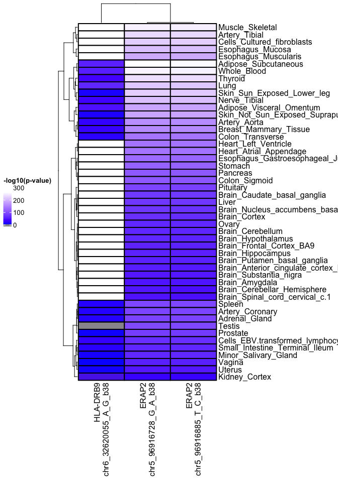

# omicAnnotations

This package annotates SNPs and gene names for available databases and
API. In particular this uses databases by:

To install:

    devtools::install_github("KatrionaGoldmann/omicAnnotations")

## Gene Annotations

For example for the entire gene summary:

    gene_df <- gene_summary(genes=c("FMOD", "FGF1", "SLAMF6"), diseases="C20")

    ## [1] "Annotating EMR's favourites..."
    ## [1] "Getting gene summaries..."
    ## [1] "Finding associated diseases..."

    kable(gene_df, format = "markdown", row.names = FALSE)

<table>
<colgroup>
<col style="width: 0%" />
<col style="width: 2%" />
<col style="width: 2%" />
<col style="width: 72%" />
<col style="width: 22%" />
</colgroup>
<thead>
<tr class="header">
<th style="text-align: left;">Gene</th>
<th style="text-align: left;">Type</th>
<th style="text-align: left;">description</th>
<th style="text-align: left;">summary</th>
<th style="text-align: left;">Associated_diseases</th>
</tr>
</thead>
<tbody>
<tr class="odd">
<td style="text-align: left;">FMOD</td>
<td style="text-align: left;"></td>
<td style="text-align: left;">fibromodulin</td>
<td style="text-align: left;">Fibromodulin belongs to the family of small interstitial proteoglycans. The encoded protein possesses a central region containing leucine-rich repeats with 4 keratan sulfate chains, flanked by terminal domains containing disulphide bonds. Owing to the interaction with type I and type II collagen fibrils and in vitro inhibition of fibrillogenesis, the encoded protein may play a role in the assembly of extracellular matrix. It may also regulate TGF-beta activities by sequestering TGF-beta into the extracellular matrix. Sequence variations in this gene may be associated with the pathogenesis of high myopia. Alternative splicing results in multiple transcript variants. [provided by RefSeq, Jun 2013]</td>
<td style="text-align: left;">Chronic Lymphocytic Leukemia; Lymphoma; B-Cell Lymphomas; Malignant lymphoma, lymphocytic, intermediate differentiation, diffuse; Adult Lymphoma; Childhood Lymphoma</td>
</tr>
<tr class="even">
<td style="text-align: left;">FGF1</td>
<td style="text-align: left;">Fibroblast Growth Factors</td>
<td style="text-align: left;"></td>
<td style="text-align: left;"></td>
<td style="text-align: left;">Rheumatoid Arthritis; Asthma; Acquired Immunodeficiency Syndrome; Diabetes Mellitus, Insulin-Dependent; Multiple Myeloma; Multiple Sclerosis; HIV Encephalopathy; HIV encephalitis; Thyroid associated opthalmopathies</td>
</tr>
<tr class="odd">
<td style="text-align: left;">SLAMF6</td>
<td style="text-align: left;"></td>
<td style="text-align: left;">SLAM family member 6</td>
<td style="text-align: left;">The protein encoded by this gene is a type I transmembrane protein, belonging to the CD2 subfamily of the immunoglobulin superfamily. This encoded protein is expressed on Natural killer (NK), T, and B lymphocytes. It undergoes tyrosine phosphorylation and associates with the Src homology 2 domain-containing protein (SH2D1A) as well as with SH2 domain-containing phosphatases (SHPs). It functions as a coreceptor in the process of NK cell activation. It can also mediate inhibitory signals in NK cells from X-linked lymphoproliferative patients. Alternative splicing results in multiple transcript variants encoding distinct isoforms.[provided by RefSeq, May 2010]</td>
<td style="text-align: left;">Graves Disease; Lupus Erythematosus, Systemic; Autoimmune Diseases; Lupus Erythematosus; HIV Infections; Chronic Lymphocytic Leukemia; Lymphoma; X-Linked Lymphoproliferative Disorder</td>
</tr>
</tbody>
</table>

### Publications

You can check for publications focusing on genes with given terms.
Either using `associated_publications`:

    gene_pubs <- associated_publications(genes=c("FGF1"), 
                                         keywords=c("rheumatoid"), 
                                         split="OR", 
                                         verbose=TRUE)

    kable(gene_pubs, format = "markdown", row.names=FALSE)

<table>
<colgroup>
<col style="width: 0%" />
<col style="width: 99%" />
</colgroup>
<thead>
<tr class="header">
<th style="text-align: left;">Gene</th>
<th style="text-align: left;">Publications</th>
</tr>
</thead>
<tbody>
<tr class="odd">
<td style="text-align: left;">FGF1</td>
<td style="text-align: left;">The transcriptomic profiling of SARS-CoV-2 compared to SARS, MERS, EBOV, and H1N1.; sICAM-1 as potential additional parameter in the discrimination of the Sjögren syndrome and non-autoimmune sicca syndrome: a pilot study.; [Effects of Huatan Tongluo Recipe on IL-1β-induced Proliferation of Rheumatoid Arthritis Synovial Fibroblasts and the Production of TNF-α and aFGF].; Fibroblast growth factors, fibroblast growth factor receptors, diseases, and drugs.; VEGF, FGF1, FGF2 and EGF gene polymorphisms and psoriatic arthritis.; Transcription factor Ets-1 regulates fibroblast growth factor-1-mediated angiogenesis in vivo: role of Ets-1 in the regulation of the PI3K/AKT/MMP-1 pathway.; Induction of RANKL expression and osteoclast maturation by the binding of fibroblast growth factor 2 to heparan sulfate proteoglycan on rheumatoid synovial fibroblasts.; Acidic fibroblast growth factor in synovial cells.; Characterization of tissue outgrowth developed in vitro in patients with rheumatoid arthritis: involvement of T cells in the development of tissue outgrowth.; Fibroblast growth factor-1 (FGF-1) enhances IL-2 production and nuclear translocation of NF-kappaB in FGF receptor-bearing Jurkat T cells.; A novel in vitro assay for human angiogenesis.; Expression and functional expansion of fibroblast growth factor receptor T cells in rheumatoid synovium and peripheral blood of patients with rheumatoid arthritis.; Detection of T cells responsive to a vascular growth factor in rheumatoid arthritis.; Coexpression of phosphotyrosine-containing proteins, platelet-derived growth factor-B, and fibroblast growth factor-1 in situ in synovial tissues of patients with rheumatoid arthritis and Lewis rats with adjuvant or streptococcal cell wall arthritis.; Platelet-derived growth factors and heparin-binding (fibroblast) growth factors in the synovial tissue pathology of rheumatoid arthritis.; Fibroblast growth factors: from genes to clinical applications.; Production of platelet derived growth factor B chain (PDGF-B/c-sis) mRNA and immunoreactive PDGF B-like polypeptide by rheumatoid synovium: coexpression with heparin binding acidic fibroblast growth factor-1.; Detection of high levels of heparin binding growth factor-1 (acidic fibroblast growth factor) in inflammatory arthritic joints.</td>
</tr>
</tbody>
</table>

Or `gene_summary`:

    gene_df <- gene_summary(genes=c("FGF1"), 
                            associated_diseases = FALSE,
                            gene_description=FALSE, 
                            publications = TRUE)

    ## [1] "Annotating EMR's favourites..."
    ## [1] "Getting publications from PubMed..."

    kable(gene_df, format = "markdown", row.names=FALSE)

<table>
<colgroup>
<col style="width: 0%" />
<col style="width: 0%" />
<col style="width: 99%" />
</colgroup>
<thead>
<tr class="header">
<th style="text-align: left;">Gene</th>
<th style="text-align: left;">Type</th>
<th style="text-align: left;">Publications</th>
</tr>
</thead>
<tbody>
<tr class="odd">
<td style="text-align: left;">FGF1</td>
<td style="text-align: left;">Fibroblast Growth Factors</td>
<td style="text-align: left;">The transcriptomic profiling of SARS-CoV-2 compared to SARS, MERS, EBOV, and H1N1.; sICAM-1 as potential additional parameter in the discrimination of the Sjögren syndrome and non-autoimmune sicca syndrome: a pilot study.; Oligodendroglial fibroblast growth factor receptor 1 gene targeting protects mice from experimental autoimmune encephalomyelitis through ERK/AKT phosphorylation.; [Effects of Huatan Tongluo Recipe on IL-1β-induced Proliferation of Rheumatoid Arthritis Synovial Fibroblasts and the Production of TNF-α and aFGF].; Dysregulation of pathways involved in the processing of cancer and microenvironment information in MCA + TPA transformed C3H/10T1/2 cells.; Fibroblast growth factors, fibroblast growth factor receptors, diseases, and drugs.; VEGF, FGF1, FGF2 and EGF gene polymorphisms and psoriatic arthritis.; Cutaneous gene expression by DNA microarray in murine sclerodermatous graft-versus-host disease, a model for human scleroderma.; Transcription factor Ets-1 regulates fibroblast growth factor-1-mediated angiogenesis in vivo: role of Ets-1 in the regulation of the PI3K/AKT/MMP-1 pathway.; Angiocidal effect of Cyclosporin A: a new therapeutic approach for pathogenic angiogenesis.; Induction of RANKL expression and osteoclast maturation by the binding of fibroblast growth factor 2 to heparan sulfate proteoglycan on rheumatoid synovial fibroblasts.; Acidic fibroblast growth factor in synovial cells.; Characterization of tissue outgrowth developed in vitro in patients with rheumatoid arthritis: involvement of T cells in the development of tissue outgrowth.; Lack of FGF-1 overexpression during autoimmune nephritis in the kidneys of MRL lpr/lpr mice.; Fibroblast growth factor-1 (FGF-1) enhances IL-2 production and nuclear translocation of NF-kappaB in FGF receptor-bearing Jurkat T cells.; Cloning and characterization of a novel upstream untranslated exon of the mouse Fgf-1 gene.; Cloning and characterization of the mouse Fgf-1 gene.; A novel in vitro assay for human angiogenesis.; Expression and functional expansion of fibroblast growth factor receptor T cells in rheumatoid synovium and peripheral blood of patients with rheumatoid arthritis.; Environmental influences on fatty acid composition of membranes from autoimmune MRL lpr/lpr mice.; Costimulation of human CD4+ T cells by fibroblast growth factor-1 (acidic fibroblast growth factor).; Detection of T cells responsive to a vascular growth factor in rheumatoid arthritis.; Coexpression of phosphotyrosine-containing proteins, platelet-derived growth factor-B, and fibroblast growth factor-1 in situ in synovial tissues of patients with rheumatoid arthritis and Lewis rats with adjuvant or streptococcal cell wall arthritis.; Platelet-derived growth factors and heparin-binding (fibroblast) growth factors in the synovial tissue pathology of rheumatoid arthritis.; Fibroblast growth factors: from genes to clinical applications.; Production of platelet derived growth factor B chain (PDGF-B/c-sis) mRNA and immunoreactive PDGF B-like polypeptide by rheumatoid synovium: coexpression with heparin binding acidic fibroblast growth factor-1.; Detection of high levels of heparin binding growth factor-1 (acidic fibroblast growth factor) in inflammatory arthritic joints.</td>
</tr>
</tbody>
</table>

### Enriched pathways

Looks for enriched pathways with gene sets using
[enrichR](https://maayanlab.cloud/Enrichr/).

    lymphoid_pathways <- enriched_pathways(
      genes=c("LAMP5", "LINC01480", "FAM92B", "SLAMF6", "CEP128",
              "FKBP11", "CRTAM", "ISG20", "ZBP1", "TMEM229B",
              "FAM46C", "XBP1", "APOBEC3G", "TNIK", "CD2", "SP140",
              "ACOXL", "PTPRCAP", "PDCD1", "KCNN3", "GZMK",
              "IGFLR1", "SH2D2A", "PIM2", "TPST2"),
      libraries = c('Pathways'),
      dbs=NULL,
      check_for_updates = FALSE)

If that doesn’t work it may be because the website is down. This happens
occasionsally. You can check by using:

    listEnrichrDbs()

Plots

    lymphoid_pathways$plot

### eQTL Catalogue

    eqtl_table <- associated_eqtl(genes=c("ENSG00000164308"), p_cutoff=1)
    kable(eqtl_table, row.names=F) 

<table>
<thead>
<tr>
<th style="text-align:left;">
rsid
</th>
<th style="text-align:right;">
chromosome
</th>
<th style="text-align:left;">
molecular\_trait\_id
</th>
<th style="text-align:left;">
gene\_id
</th>
<th style="text-align:left;">
tissue
</th>
<th style="text-align:left;">
qtl\_group
</th>
<th style="text-align:right;">
pvalue
</th>
<th style="text-align:right;">
neg\_log10\_pvalue
</th>
<th style="text-align:right;">
se
</th>
<th style="text-align:right;">
beta
</th>
<th style="text-align:right;">
median\_tpm
</th>
<th style="text-align:left;">
study\_id
</th>
<th style="text-align:left;">
type
</th>
<th style="text-align:left;">
alt
</th>
<th style="text-align:right;">
position
</th>
<th style="text-align:right;">
ac
</th>
<th style="text-align:right;">
maf
</th>
<th style="text-align:left;">
variant
</th>
<th style="text-align:left;">
ref
</th>
<th style="text-align:right;">
r2
</th>
<th style="text-align:right;">
an
</th>
</tr>
</thead>
<tbody>
<tr>
<td style="text-align:left;">
rs57584041
</td>
<td style="text-align:right;">
5
</td>
<td style="text-align:left;">
ENSG00000164308
</td>
<td style="text-align:left;">
ENSG00000164308
</td>
<td style="text-align:left;">
CL\_0000235
</td>
<td style="text-align:left;">
macrophage\_IFNg
</td>
<td style="text-align:right;">
0.142464
</td>
<td style="text-align:right;">
0.8462949
</td>
<td style="text-align:right;">
0.862435
</td>
<td style="text-align:right;">
1.2793100
</td>
<td style="text-align:right;">
14.576
</td>
<td style="text-align:left;">
Alasoo\_2018
</td>
<td style="text-align:left;">
SNP
</td>
<td style="text-align:left;">
C
</td>
<td style="text-align:right;">
95877044
</td>
<td style="text-align:right;">
5
</td>
<td style="text-align:right;">
0.0297619
</td>
<td style="text-align:left;">
chr5\_95877044\_T\_C
</td>
<td style="text-align:left;">
T
</td>
<td style="text-align:right;">
0.87667
</td>
<td style="text-align:right;">
168
</td>
</tr>
<tr>
<td style="text-align:left;">
rs6556892
</td>
<td style="text-align:right;">
5
</td>
<td style="text-align:left;">
ENSG00000164308
</td>
<td style="text-align:left;">
ENSG00000164308
</td>
<td style="text-align:left;">
CL\_0000235
</td>
<td style="text-align:left;">
macrophage\_IFNg
</td>
<td style="text-align:right;">
0.299611
</td>
<td style="text-align:right;">
0.5234422
</td>
<td style="text-align:right;">
0.338419
</td>
<td style="text-align:right;">
0.3536530
</td>
<td style="text-align:right;">
14.576
</td>
<td style="text-align:left;">
Alasoo\_2018
</td>
<td style="text-align:left;">
SNP
</td>
<td style="text-align:left;">
A
</td>
<td style="text-align:right;">
95878071
</td>
<td style="text-align:right;">
56
</td>
<td style="text-align:right;">
0.3333330
</td>
<td style="text-align:left;">
chr5\_95878071\_C\_A
</td>
<td style="text-align:left;">
C
</td>
<td style="text-align:right;">
0.92606
</td>
<td style="text-align:right;">
168
</td>
</tr>
<tr>
<td style="text-align:left;">
rs55763081
</td>
<td style="text-align:right;">
5
</td>
<td style="text-align:left;">
ENSG00000164308
</td>
<td style="text-align:left;">
ENSG00000164308
</td>
<td style="text-align:left;">
CL\_0000235
</td>
<td style="text-align:left;">
macrophage\_IFNg
</td>
<td style="text-align:right;">
0.324924
</td>
<td style="text-align:right;">
0.4882182
</td>
<td style="text-align:right;">
1.103560
</td>
<td style="text-align:right;">
-1.0940300
</td>
<td style="text-align:right;">
14.576
</td>
<td style="text-align:left;">
Alasoo\_2018
</td>
<td style="text-align:left;">
SNP
</td>
<td style="text-align:left;">
G
</td>
<td style="text-align:right;">
95876702
</td>
<td style="text-align:right;">
3
</td>
<td style="text-align:right;">
0.0178571
</td>
<td style="text-align:left;">
chr5\_95876702\_A\_G
</td>
<td style="text-align:left;">
A
</td>
<td style="text-align:right;">
0.81827
</td>
<td style="text-align:right;">
168
</td>
</tr>
<tr>
<td style="text-align:left;">
rs61540882
</td>
<td style="text-align:right;">
5
</td>
<td style="text-align:left;">
ENSG00000164308
</td>
<td style="text-align:left;">
ENSG00000164308
</td>
<td style="text-align:left;">
CL\_0000235
</td>
<td style="text-align:left;">
macrophage\_IFNg
</td>
<td style="text-align:right;">
0.325028
</td>
<td style="text-align:right;">
0.4880792
</td>
<td style="text-align:right;">
1.103460
</td>
<td style="text-align:right;">
-1.0936900
</td>
<td style="text-align:right;">
14.576
</td>
<td style="text-align:left;">
Alasoo\_2018
</td>
<td style="text-align:left;">
INDEL
</td>
<td style="text-align:left;">
T
</td>
<td style="text-align:right;">
95876577
</td>
<td style="text-align:right;">
3
</td>
<td style="text-align:right;">
0.0178571
</td>
<td style="text-align:left;">
chr5\_95876577\_TAAA\_T
</td>
<td style="text-align:left;">
TAAA
</td>
<td style="text-align:right;">
0.81754
</td>
<td style="text-align:right;">
168
</td>
</tr>
<tr>
<td style="text-align:left;">
rs796285486
</td>
<td style="text-align:right;">
5
</td>
<td style="text-align:left;">
ENSG00000164308
</td>
<td style="text-align:left;">
ENSG00000164308
</td>
<td style="text-align:left;">
CL\_0000235
</td>
<td style="text-align:left;">
macrophage\_IFNg
</td>
<td style="text-align:right;">
0.325028
</td>
<td style="text-align:right;">
0.4880792
</td>
<td style="text-align:right;">
1.103460
</td>
<td style="text-align:right;">
-1.0936900
</td>
<td style="text-align:right;">
14.576
</td>
<td style="text-align:left;">
Alasoo\_2018
</td>
<td style="text-align:left;">
INDEL
</td>
<td style="text-align:left;">
T
</td>
<td style="text-align:right;">
95876577
</td>
<td style="text-align:right;">
3
</td>
<td style="text-align:right;">
0.0178571
</td>
<td style="text-align:left;">
chr5\_95876577\_TAAA\_T
</td>
<td style="text-align:left;">
TAAA
</td>
<td style="text-align:right;">
0.81754
</td>
<td style="text-align:right;">
168
</td>
</tr>
<tr>
<td style="text-align:left;">
rs154457
</td>
<td style="text-align:right;">
5
</td>
<td style="text-align:left;">
ENSG00000164308
</td>
<td style="text-align:left;">
ENSG00000164308
</td>
<td style="text-align:left;">
CL\_0000235
</td>
<td style="text-align:left;">
macrophage\_IFNg
</td>
<td style="text-align:right;">
0.347034
</td>
<td style="text-align:right;">
0.4596280
</td>
<td style="text-align:right;">
0.376044
</td>
<td style="text-align:right;">
0.3560110
</td>
<td style="text-align:right;">
14.576
</td>
<td style="text-align:left;">
Alasoo\_2018
</td>
<td style="text-align:left;">
SNP
</td>
<td style="text-align:left;">
A
</td>
<td style="text-align:right;">
95876181
</td>
<td style="text-align:right;">
130
</td>
<td style="text-align:right;">
0.2261900
</td>
<td style="text-align:left;">
chr5\_95876181\_G\_A
</td>
<td style="text-align:left;">
G
</td>
<td style="text-align:right;">
0.93729
</td>
<td style="text-align:right;">
168
</td>
</tr>
<tr>
<td style="text-align:left;">
rs154458
</td>
<td style="text-align:right;">
5
</td>
<td style="text-align:left;">
ENSG00000164308
</td>
<td style="text-align:left;">
ENSG00000164308
</td>
<td style="text-align:left;">
CL\_0000235
</td>
<td style="text-align:left;">
macrophage\_IFNg
</td>
<td style="text-align:right;">
0.354738
</td>
<td style="text-align:right;">
0.4500923
</td>
<td style="text-align:right;">
0.375816
</td>
<td style="text-align:right;">
0.3501150
</td>
<td style="text-align:right;">
14.576
</td>
<td style="text-align:left;">
Alasoo\_2018
</td>
<td style="text-align:left;">
SNP
</td>
<td style="text-align:left;">
T
</td>
<td style="text-align:right;">
95876288
</td>
<td style="text-align:right;">
130
</td>
<td style="text-align:right;">
0.2261900
</td>
<td style="text-align:left;">
chr5\_95876288\_C\_T
</td>
<td style="text-align:left;">
C
</td>
<td style="text-align:right;">
0.94067
</td>
<td style="text-align:right;">
168
</td>
</tr>
<tr>
<td style="text-align:left;">
rs154456
</td>
<td style="text-align:right;">
5
</td>
<td style="text-align:left;">
ENSG00000164308
</td>
<td style="text-align:left;">
ENSG00000164308
</td>
<td style="text-align:left;">
CL\_0000235
</td>
<td style="text-align:left;">
macrophage\_IFNg
</td>
<td style="text-align:right;">
0.355252
</td>
<td style="text-align:right;">
0.4494635
</td>
<td style="text-align:right;">
0.375702
</td>
<td style="text-align:right;">
0.3496330
</td>
<td style="text-align:right;">
14.576
</td>
<td style="text-align:left;">
Alasoo\_2018
</td>
<td style="text-align:left;">
SNP
</td>
<td style="text-align:left;">
T
</td>
<td style="text-align:right;">
95876161
</td>
<td style="text-align:right;">
130
</td>
<td style="text-align:right;">
0.2261900
</td>
<td style="text-align:left;">
chr5\_95876161\_A\_T
</td>
<td style="text-align:left;">
A
</td>
<td style="text-align:right;">
0.94121
</td>
<td style="text-align:right;">
168
</td>
</tr>
<tr>
<td style="text-align:left;">
rs144088066
</td>
<td style="text-align:right;">
5
</td>
<td style="text-align:left;">
ENSG00000164308
</td>
<td style="text-align:left;">
ENSG00000164308
</td>
<td style="text-align:left;">
CL\_0000235
</td>
<td style="text-align:left;">
macrophage\_IFNg
</td>
<td style="text-align:right;">
0.358421
</td>
<td style="text-align:right;">
0.4456066
</td>
<td style="text-align:right;">
1.143510
</td>
<td style="text-align:right;">
-1.0571400
</td>
<td style="text-align:right;">
14.576
</td>
<td style="text-align:left;">
Alasoo\_2018
</td>
<td style="text-align:left;">
INDEL
</td>
<td style="text-align:left;">
C
</td>
<td style="text-align:right;">
95878406
</td>
<td style="text-align:right;">
3
</td>
<td style="text-align:right;">
0.0178571
</td>
<td style="text-align:left;">
chr5\_95878406\_CTCT\_C
</td>
<td style="text-align:left;">
CTCT
</td>
<td style="text-align:right;">
0.74292
</td>
<td style="text-align:right;">
168
</td>
</tr>
<tr>
<td style="text-align:left;">
rs17085223
</td>
<td style="text-align:right;">
5
</td>
<td style="text-align:left;">
ENSG00000164308
</td>
<td style="text-align:left;">
ENSG00000164308
</td>
<td style="text-align:left;">
CL\_0000235
</td>
<td style="text-align:left;">
macrophage\_IFNg
</td>
<td style="text-align:right;">
0.363755
</td>
<td style="text-align:right;">
0.4391910
</td>
<td style="text-align:right;">
1.139710
</td>
<td style="text-align:right;">
-1.0419100
</td>
<td style="text-align:right;">
14.576
</td>
<td style="text-align:left;">
Alasoo\_2018
</td>
<td style="text-align:left;">
SNP
</td>
<td style="text-align:left;">
T
</td>
<td style="text-align:right;">
95877713
</td>
<td style="text-align:right;">
3
</td>
<td style="text-align:right;">
0.0178571
</td>
<td style="text-align:left;">
chr5\_95877713\_G\_T
</td>
<td style="text-align:left;">
G
</td>
<td style="text-align:right;">
0.77062
</td>
<td style="text-align:right;">
168
</td>
</tr>
<tr>
<td style="text-align:left;">
rs113842599
</td>
<td style="text-align:right;">
5
</td>
<td style="text-align:left;">
ENSG00000164308
</td>
<td style="text-align:left;">
ENSG00000164308
</td>
<td style="text-align:left;">
CL\_0000235
</td>
<td style="text-align:left;">
macrophage\_IFNg
</td>
<td style="text-align:right;">
0.402339
</td>
<td style="text-align:right;">
0.3954079
</td>
<td style="text-align:right;">
1.153880
</td>
<td style="text-align:right;">
-0.9722280
</td>
<td style="text-align:right;">
14.576
</td>
<td style="text-align:left;">
Alasoo\_2018
</td>
<td style="text-align:left;">
SNP
</td>
<td style="text-align:left;">
G
</td>
<td style="text-align:right;">
95878112
</td>
<td style="text-align:right;">
3
</td>
<td style="text-align:right;">
0.0178571
</td>
<td style="text-align:left;">
chr5\_95878112\_C\_G
</td>
<td style="text-align:left;">
C
</td>
<td style="text-align:right;">
0.70249
</td>
<td style="text-align:right;">
168
</td>
</tr>
<tr>
<td style="text-align:left;">
rs749046156
</td>
<td style="text-align:right;">
5
</td>
<td style="text-align:left;">
ENSG00000164308
</td>
<td style="text-align:left;">
ENSG00000164308
</td>
<td style="text-align:left;">
CL\_0000235
</td>
<td style="text-align:left;">
macrophage\_IFNg
</td>
<td style="text-align:right;">
0.409355
</td>
<td style="text-align:right;">
0.3878999
</td>
<td style="text-align:right;">
0.958131
</td>
<td style="text-align:right;">
0.7952580
</td>
<td style="text-align:right;">
14.576
</td>
<td style="text-align:left;">
Alasoo\_2018
</td>
<td style="text-align:left;">
INDEL
</td>
<td style="text-align:left;">
GT
</td>
<td style="text-align:right;">
95877403
</td>
<td style="text-align:right;">
5
</td>
<td style="text-align:right;">
0.0297619
</td>
<td style="text-align:left;">
chr5\_95877403\_G\_GT
</td>
<td style="text-align:left;">
G
</td>
<td style="text-align:right;">
0.65265
</td>
<td style="text-align:right;">
168
</td>
</tr>
<tr>
<td style="text-align:left;">
rs397957177
</td>
<td style="text-align:right;">
5
</td>
<td style="text-align:left;">
ENSG00000164308
</td>
<td style="text-align:left;">
ENSG00000164308
</td>
<td style="text-align:left;">
CL\_0000235
</td>
<td style="text-align:left;">
macrophage\_IFNg
</td>
<td style="text-align:right;">
0.409355
</td>
<td style="text-align:right;">
0.3878999
</td>
<td style="text-align:right;">
0.958131
</td>
<td style="text-align:right;">
0.7952580
</td>
<td style="text-align:right;">
14.576
</td>
<td style="text-align:left;">
Alasoo\_2018
</td>
<td style="text-align:left;">
INDEL
</td>
<td style="text-align:left;">
GT
</td>
<td style="text-align:right;">
95877403
</td>
<td style="text-align:right;">
5
</td>
<td style="text-align:right;">
0.0297619
</td>
<td style="text-align:left;">
chr5\_95877403\_G\_GT
</td>
<td style="text-align:left;">
G
</td>
<td style="text-align:right;">
0.65265
</td>
<td style="text-align:right;">
168
</td>
</tr>
<tr>
<td style="text-align:left;">
rs1256088833
</td>
<td style="text-align:right;">
5
</td>
<td style="text-align:left;">
ENSG00000164308
</td>
<td style="text-align:left;">
ENSG00000164308
</td>
<td style="text-align:left;">
CL\_0000235
</td>
<td style="text-align:left;">
macrophage\_IFNg
</td>
<td style="text-align:right;">
0.482832
</td>
<td style="text-align:right;">
0.3162040
</td>
<td style="text-align:right;">
1.163830
</td>
<td style="text-align:right;">
-0.8210970
</td>
<td style="text-align:right;">
14.576
</td>
<td style="text-align:left;">
Alasoo\_2018
</td>
<td style="text-align:left;">
INDEL
</td>
<td style="text-align:left;">
G
</td>
<td style="text-align:right;">
95877403
</td>
<td style="text-align:right;">
2
</td>
<td style="text-align:right;">
0.0119048
</td>
<td style="text-align:left;">
chr5\_95877403\_GT\_G
</td>
<td style="text-align:left;">
GT
</td>
<td style="text-align:right;">
0.58191
</td>
<td style="text-align:right;">
168
</td>
</tr>
<tr>
<td style="text-align:left;">
rs111471052
</td>
<td style="text-align:right;">
5
</td>
<td style="text-align:left;">
ENSG00000164308
</td>
<td style="text-align:left;">
ENSG00000164308
</td>
<td style="text-align:left;">
CL\_0000235
</td>
<td style="text-align:left;">
macrophage\_IFNg
</td>
<td style="text-align:right;">
0.482832
</td>
<td style="text-align:right;">
0.3162040
</td>
<td style="text-align:right;">
1.163830
</td>
<td style="text-align:right;">
-0.8210970
</td>
<td style="text-align:right;">
14.576
</td>
<td style="text-align:left;">
Alasoo\_2018
</td>
<td style="text-align:left;">
INDEL
</td>
<td style="text-align:left;">
G
</td>
<td style="text-align:right;">
95877403
</td>
<td style="text-align:right;">
2
</td>
<td style="text-align:right;">
0.0119048
</td>
<td style="text-align:left;">
chr5\_95877403\_GT\_G
</td>
<td style="text-align:left;">
GT
</td>
<td style="text-align:right;">
0.58191
</td>
<td style="text-align:right;">
168
</td>
</tr>
<tr>
<td style="text-align:left;">
rs154454
</td>
<td style="text-align:right;">
5
</td>
<td style="text-align:left;">
ENSG00000164308
</td>
<td style="text-align:left;">
ENSG00000164308
</td>
<td style="text-align:left;">
CL\_0000235
</td>
<td style="text-align:left;">
macrophage\_IFNg
</td>
<td style="text-align:right;">
0.537536
</td>
<td style="text-align:right;">
0.2695924
</td>
<td style="text-align:right;">
0.385196
</td>
<td style="text-align:right;">
0.2386650
</td>
<td style="text-align:right;">
14.576
</td>
<td style="text-align:left;">
Alasoo\_2018
</td>
<td style="text-align:left;">
SNP
</td>
<td style="text-align:left;">
G
</td>
<td style="text-align:right;">
95875943
</td>
<td style="text-align:right;">
133
</td>
<td style="text-align:right;">
0.2083330
</td>
<td style="text-align:left;">
chr5\_95875943\_C\_G
</td>
<td style="text-align:left;">
C
</td>
<td style="text-align:right;">
0.96320
</td>
<td style="text-align:right;">
168
</td>
</tr>
<tr>
<td style="text-align:left;">
rs11372327
</td>
<td style="text-align:right;">
5
</td>
<td style="text-align:left;">
ENSG00000164308
</td>
<td style="text-align:left;">
ENSG00000164308
</td>
<td style="text-align:left;">
CL\_0000235
</td>
<td style="text-align:left;">
macrophage\_IFNg
</td>
<td style="text-align:right;">
0.710863
</td>
<td style="text-align:right;">
0.1482141
</td>
<td style="text-align:right;">
0.818859
</td>
<td style="text-align:right;">
-0.3047850
</td>
<td style="text-align:right;">
14.576
</td>
<td style="text-align:left;">
Alasoo\_2018
</td>
<td style="text-align:left;">
INDEL
</td>
<td style="text-align:left;">
AC
</td>
<td style="text-align:right;">
95878741
</td>
<td style="text-align:right;">
162
</td>
<td style="text-align:right;">
0.0357143
</td>
<td style="text-align:left;">
chr5\_95878741\_A\_AC
</td>
<td style="text-align:left;">
A
</td>
<td style="text-align:right;">
0.91136
</td>
<td style="text-align:right;">
168
</td>
</tr>
<tr>
<td style="text-align:left;">
rs397998782
</td>
<td style="text-align:right;">
5
</td>
<td style="text-align:left;">
ENSG00000164308
</td>
<td style="text-align:left;">
ENSG00000164308
</td>
<td style="text-align:left;">
CL\_0000235
</td>
<td style="text-align:left;">
macrophage\_IFNg
</td>
<td style="text-align:right;">
0.710863
</td>
<td style="text-align:right;">
0.1482141
</td>
<td style="text-align:right;">
0.818859
</td>
<td style="text-align:right;">
-0.3047850
</td>
<td style="text-align:right;">
14.576
</td>
<td style="text-align:left;">
Alasoo\_2018
</td>
<td style="text-align:left;">
INDEL
</td>
<td style="text-align:left;">
AC
</td>
<td style="text-align:right;">
95878741
</td>
<td style="text-align:right;">
162
</td>
<td style="text-align:right;">
0.0357143
</td>
<td style="text-align:left;">
chr5\_95878741\_A\_AC
</td>
<td style="text-align:left;">
A
</td>
<td style="text-align:right;">
0.91136
</td>
<td style="text-align:right;">
168
</td>
</tr>
<tr>
<td style="text-align:left;">
rs154459
</td>
<td style="text-align:right;">
5
</td>
<td style="text-align:left;">
ENSG00000164308
</td>
<td style="text-align:left;">
ENSG00000164308
</td>
<td style="text-align:left;">
CL\_0000235
</td>
<td style="text-align:left;">
macrophage\_IFNg
</td>
<td style="text-align:right;">
0.738887
</td>
<td style="text-align:right;">
0.1314220
</td>
<td style="text-align:right;">
0.332555
</td>
<td style="text-align:right;">
-0.1112910
</td>
<td style="text-align:right;">
14.576
</td>
<td style="text-align:left;">
Alasoo\_2018
</td>
<td style="text-align:left;">
SNP
</td>
<td style="text-align:left;">
T
</td>
<td style="text-align:right;">
95876578
</td>
<td style="text-align:right;">
72
</td>
<td style="text-align:right;">
0.4285710
</td>
<td style="text-align:left;">
chr5\_95876578\_A\_T
</td>
<td style="text-align:left;">
A
</td>
<td style="text-align:right;">
0.94702
</td>
<td style="text-align:right;">
168
</td>
</tr>
<tr>
<td style="text-align:left;">
rs154455
</td>
<td style="text-align:right;">
5
</td>
<td style="text-align:left;">
ENSG00000164308
</td>
<td style="text-align:left;">
ENSG00000164308
</td>
<td style="text-align:left;">
CL\_0000235
</td>
<td style="text-align:left;">
macrophage\_IFNg
</td>
<td style="text-align:right;">
0.803819
</td>
<td style="text-align:right;">
0.0948417
</td>
<td style="text-align:right;">
0.335028
</td>
<td style="text-align:right;">
-0.0835397
</td>
<td style="text-align:right;">
14.576
</td>
<td style="text-align:left;">
Alasoo\_2018
</td>
<td style="text-align:left;">
SNP
</td>
<td style="text-align:left;">
T
</td>
<td style="text-align:right;">
95876057
</td>
<td style="text-align:right;">
74
</td>
<td style="text-align:right;">
0.4404760
</td>
<td style="text-align:left;">
chr5\_95876057\_C\_T
</td>
<td style="text-align:left;">
C
</td>
<td style="text-align:right;">
0.96802
</td>
<td style="text-align:right;">
168
</td>
</tr>
</tbody>
</table>

## SNP Annotations

omicAnnotations can also be used to find out more info about SNPs.

### GWAS Catalogue

    gwas_traits <- associated_traits(snps = c("rs2910686", "rs7329174"))

    kable(gwas_traits, row.names = F) 

<table>
<thead>
<tr>
<th style="text-align:left;">
SNPs
</th>
<th style="text-align:left;">
Associated\_traits
</th>
</tr>
</thead>
<tbody>
<tr>
<td style="text-align:left;">
rs2910686
</td>
<td style="text-align:left;">
neutrophil count; ankylosing spondylitis; crohn’s disease; psoriasis;
sclerosing cholangitis; ulcerative colitis
</td>
</tr>
<tr>
<td style="text-align:left;">
rs7329174
</td>
<td style="text-align:left;">
systemic lupus erythematosus; crohn’s disease
</td>
</tr>
</tbody>
</table>

### eQTL Catalogue

    eqtl_table <- associated_eqtl(snps = c("rs2910686", "rs7329174"),
                                  p_cutoff = 0.05)

    kable(eqtl_table, row.names = F) 

<table>
<thead>
<tr>
<th style="text-align:left;">
rsid
</th>
<th style="text-align:right;">
chromosome
</th>
<th style="text-align:left;">
molecular\_trait\_id
</th>
<th style="text-align:left;">
gene\_id
</th>
<th style="text-align:left;">
tissue
</th>
<th style="text-align:left;">
qtl\_group
</th>
<th style="text-align:right;">
pvalue
</th>
<th style="text-align:right;">
neg\_log10\_pvalue
</th>
<th style="text-align:right;">
se
</th>
<th style="text-align:right;">
beta
</th>
<th style="text-align:right;">
median\_tpm
</th>
<th style="text-align:left;">
study\_id
</th>
<th style="text-align:left;">
type
</th>
<th style="text-align:left;">
alt
</th>
<th style="text-align:right;">
position
</th>
<th style="text-align:right;">
ac
</th>
<th style="text-align:right;">
maf
</th>
<th style="text-align:left;">
variant
</th>
<th style="text-align:left;">
ref
</th>
<th style="text-align:right;">
r2
</th>
<th style="text-align:right;">
an
</th>
</tr>
</thead>
<tbody>
<tr>
<td style="text-align:left;">
rs2910686
</td>
<td style="text-align:right;">
5
</td>
<td style="text-align:left;">
ENSG00000164308
</td>
<td style="text-align:left;">
ENSG00000164308
</td>
<td style="text-align:left;">
CL\_0000235
</td>
<td style="text-align:left;">
macrophage\_IFNg
</td>
<td style="text-align:right;">
0.0000000
</td>
<td style="text-align:right;">
32.033736
</td>
<td style="text-align:right;">
0.1084150
</td>
<td style="text-align:right;">
2.3491000
</td>
<td style="text-align:right;">
14.576
</td>
<td style="text-align:left;">
Alasoo\_2018
</td>
<td style="text-align:left;">
SNP
</td>
<td style="text-align:left;">
C
</td>
<td style="text-align:right;">
96916885
</td>
<td style="text-align:right;">
68
</td>
<td style="text-align:right;">
0.4047620
</td>
<td style="text-align:left;">
rs2910686
</td>
<td style="text-align:left;">
T
</td>
<td style="text-align:right;">
0.99787
</td>
<td style="text-align:right;">
168
</td>
</tr>
<tr>
<td style="text-align:left;">
rs2910686
</td>
<td style="text-align:right;">
5
</td>
<td style="text-align:left;">
ENSG00000164308
</td>
<td style="text-align:left;">
ENSG00000164308
</td>
<td style="text-align:left;">
CL\_0000235
</td>
<td style="text-align:left;">
macrophage\_IFNg
</td>
<td style="text-align:right;">
0.0000000
</td>
<td style="text-align:right;">
28.094117
</td>
<td style="text-align:right;">
0.1188220
</td>
<td style="text-align:right;">
2.2120400
</td>
<td style="text-align:right;">
14.576
</td>
<td style="text-align:left;">
Alasoo\_2018
</td>
<td style="text-align:left;">
SNP
</td>
<td style="text-align:left;">
C
</td>
<td style="text-align:right;">
96916885
</td>
<td style="text-align:right;">
68
</td>
<td style="text-align:right;">
0.4047620
</td>
<td style="text-align:left;">
rs2910686
</td>
<td style="text-align:left;">
T
</td>
<td style="text-align:right;">
0.99787
</td>
<td style="text-align:right;">
168
</td>
</tr>
<tr>
<td style="text-align:left;">
rs2910686
</td>
<td style="text-align:right;">
5
</td>
<td style="text-align:left;">
ENSG00000164307
</td>
<td style="text-align:left;">
ENSG00000164307
</td>
<td style="text-align:left;">
CL\_0000235
</td>
<td style="text-align:left;">
macrophage\_IFNg
</td>
<td style="text-align:right;">
0.0001333
</td>
<td style="text-align:right;">
3.875124
</td>
<td style="text-align:right;">
0.0474250
</td>
<td style="text-align:right;">
-0.1917860
</td>
<td style="text-align:right;">
50.151
</td>
<td style="text-align:left;">
Alasoo\_2018
</td>
<td style="text-align:left;">
SNP
</td>
<td style="text-align:left;">
C
</td>
<td style="text-align:right;">
96916885
</td>
<td style="text-align:right;">
68
</td>
<td style="text-align:right;">
0.4047620
</td>
<td style="text-align:left;">
rs2910686
</td>
<td style="text-align:left;">
T
</td>
<td style="text-align:right;">
0.99787
</td>
<td style="text-align:right;">
168
</td>
</tr>
<tr>
<td style="text-align:left;">
rs7329174
</td>
<td style="text-align:right;">
13
</td>
<td style="text-align:left;">
ENSG00000102760
</td>
<td style="text-align:left;">
ENSG00000102760
</td>
<td style="text-align:left;">
UBERON\_0001013
</td>
<td style="text-align:left;">
adipose\_naive
</td>
<td style="text-align:right;">
0.0006357
</td>
<td style="text-align:right;">
3.196736
</td>
<td style="text-align:right;">
0.0714243
</td>
<td style="text-align:right;">
0.2470190
</td>
<td style="text-align:right;">
445.066
</td>
<td style="text-align:left;">
FUSION
</td>
<td style="text-align:left;">
SNP
</td>
<td style="text-align:left;">
G
</td>
<td style="text-align:right;">
40983974
</td>
<td style="text-align:right;">
38
</td>
<td style="text-align:right;">
0.0701107
</td>
<td style="text-align:left;">
rs7329174
</td>
<td style="text-align:left;">
A
</td>
<td style="text-align:right;">
1.00000
</td>
<td style="text-align:right;">
542
</td>
</tr>
<tr>
<td style="text-align:left;">
rs2910686
</td>
<td style="text-align:right;">
5
</td>
<td style="text-align:left;">
ENSG00000247121
</td>
<td style="text-align:left;">
ENSG00000247121
</td>
<td style="text-align:left;">
CL\_0000235
</td>
<td style="text-align:left;">
macrophage\_IFNg
</td>
<td style="text-align:right;">
0.0007469
</td>
<td style="text-align:right;">
3.126725
</td>
<td style="text-align:right;">
0.0779628
</td>
<td style="text-align:right;">
-0.2749620
</td>
<td style="text-align:right;">
1.260
</td>
<td style="text-align:left;">
Alasoo\_2018
</td>
<td style="text-align:left;">
SNP
</td>
<td style="text-align:left;">
C
</td>
<td style="text-align:right;">
96916885
</td>
<td style="text-align:right;">
68
</td>
<td style="text-align:right;">
0.4047620
</td>
<td style="text-align:left;">
rs2910686
</td>
<td style="text-align:left;">
T
</td>
<td style="text-align:right;">
0.99787
</td>
<td style="text-align:right;">
168
</td>
</tr>
<tr>
<td style="text-align:left;">
rs2910686
</td>
<td style="text-align:right;">
5
</td>
<td style="text-align:left;">
ENSG00000164307
</td>
<td style="text-align:left;">
ENSG00000164307
</td>
<td style="text-align:left;">
CL\_0000235
</td>
<td style="text-align:left;">
macrophage\_IFNg
</td>
<td style="text-align:right;">
0.0008048
</td>
<td style="text-align:right;">
3.094338
</td>
<td style="text-align:right;">
0.0611752
</td>
<td style="text-align:right;">
-0.2143270
</td>
<td style="text-align:right;">
50.151
</td>
<td style="text-align:left;">
Alasoo\_2018
</td>
<td style="text-align:left;">
SNP
</td>
<td style="text-align:left;">
C
</td>
<td style="text-align:right;">
96916885
</td>
<td style="text-align:right;">
68
</td>
<td style="text-align:right;">
0.4047620
</td>
<td style="text-align:left;">
rs2910686
</td>
<td style="text-align:left;">
T
</td>
<td style="text-align:right;">
0.99787
</td>
<td style="text-align:right;">
168
</td>
</tr>
<tr>
<td style="text-align:left;">
rs2910686
</td>
<td style="text-align:right;">
5
</td>
<td style="text-align:left;">
ENSG00000113441
</td>
<td style="text-align:left;">
ENSG00000113441
</td>
<td style="text-align:left;">
CL\_0000235
</td>
<td style="text-align:left;">
macrophage\_IFNg
</td>
<td style="text-align:right;">
0.0012984
</td>
<td style="text-align:right;">
2.886608
</td>
<td style="text-align:right;">
0.0291856
</td>
<td style="text-align:right;">
0.0978188
</td>
<td style="text-align:right;">
14.738
</td>
<td style="text-align:left;">
Alasoo\_2018
</td>
<td style="text-align:left;">
SNP
</td>
<td style="text-align:left;">
C
</td>
<td style="text-align:right;">
96916885
</td>
<td style="text-align:right;">
68
</td>
<td style="text-align:right;">
0.4047620
</td>
<td style="text-align:left;">
rs2910686
</td>
<td style="text-align:left;">
T
</td>
<td style="text-align:right;">
0.99787
</td>
<td style="text-align:right;">
168
</td>
</tr>
<tr>
<td style="text-align:left;">
rs7329174
</td>
<td style="text-align:right;">
13
</td>
<td style="text-align:left;">
ENSG00000278390
</td>
<td style="text-align:left;">
ENSG00000278390
</td>
<td style="text-align:left;">
UBERON\_0009834
</td>
<td style="text-align:left;">
brain
</td>
<td style="text-align:right;">
0.0053281
</td>
<td style="text-align:right;">
2.273430
</td>
<td style="text-align:right;">
0.0627828
</td>
<td style="text-align:right;">
-0.1757720
</td>
<td style="text-align:right;">
3.801
</td>
<td style="text-align:left;">
BrainSeq
</td>
<td style="text-align:left;">
SNP
</td>
<td style="text-align:left;">
G
</td>
<td style="text-align:right;">
40983974
</td>
<td style="text-align:right;">
39
</td>
<td style="text-align:right;">
0.0407098
</td>
<td style="text-align:left;">
rs7329174
</td>
<td style="text-align:left;">
A
</td>
<td style="text-align:right;">
0.93510
</td>
<td style="text-align:right;">
958
</td>
</tr>
<tr>
<td style="text-align:left;">
rs7329174
</td>
<td style="text-align:right;">
13
</td>
<td style="text-align:left;">
ENSG00000102743
</td>
<td style="text-align:left;">
ENSG00000102743
</td>
<td style="text-align:left;">
UBERON\_0001013
</td>
<td style="text-align:left;">
adipose\_naive
</td>
<td style="text-align:right;">
0.0291754
</td>
<td style="text-align:right;">
1.534983
</td>
<td style="text-align:right;">
0.0500392
</td>
<td style="text-align:right;">
-0.1097560
</td>
<td style="text-align:right;">
3.886
</td>
<td style="text-align:left;">
FUSION
</td>
<td style="text-align:left;">
SNP
</td>
<td style="text-align:left;">
G
</td>
<td style="text-align:right;">
40983974
</td>
<td style="text-align:right;">
38
</td>
<td style="text-align:right;">
0.0701107
</td>
<td style="text-align:left;">
rs7329174
</td>
<td style="text-align:left;">
A
</td>
<td style="text-align:right;">
1.00000
</td>
<td style="text-align:right;">
542
</td>
</tr>
<tr>
<td style="text-align:left;">
rs2910686
</td>
<td style="text-align:right;">
5
</td>
<td style="text-align:left;">
ENSG00000113441
</td>
<td style="text-align:left;">
ENSG00000113441
</td>
<td style="text-align:left;">
CL\_0000235
</td>
<td style="text-align:left;">
macrophage\_naive
</td>
<td style="text-align:right;">
0.0482241
</td>
<td style="text-align:right;">
1.316736
</td>
<td style="text-align:right;">
0.0258004
</td>
<td style="text-align:right;">
0.0518735
</td>
<td style="text-align:right;">
14.738
</td>
<td style="text-align:left;">
Alasoo\_2018
</td>
<td style="text-align:left;">
SNP
</td>
<td style="text-align:left;">
C
</td>
<td style="text-align:right;">
96916885
</td>
<td style="text-align:right;">
68
</td>
<td style="text-align:right;">
0.4047620
</td>
<td style="text-align:left;">
rs2910686
</td>
<td style="text-align:left;">
T
</td>
<td style="text-align:right;">
0.99787
</td>
<td style="text-align:right;">
168
</td>
</tr>
</tbody>
</table>

### GTex

    g2s <- data.frame("Genes"=c("ERAP2", "ERAP2", "HLA-DRB9"), 
                      "Snps"=c("chr5_96916728_G_A", "chr5_96916885_T_C", 
                               "chr6_32620055_A_G"))

    df <- gtex_eqtl(gene_snp_pairs = g2s)

    library(ComplexHeatmap)

    hm <- gtex_heatmap(df)
    draw(hm, heatmap_legend_side = "left")

